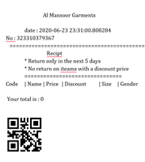

# Retail Application
```
    "username" : "Shahid"
    "password" : anabiya
```

This package enables a user to scan barcodes and use them in a retail enviornment without having to buy expensive barcode scanners.
The app uses Cv2 for video capturing.
the app also has an integrated database in the form on an Sqlite3 database.

## **Functions**
1) the app can add items to the database for which you have to scan the barcode using the camera and enter the relavent data after this the app keeps track of your inventory 
2) the app marks products as sold and reduce your current inventory it also keeps track off any discounts and all the monitary changes
3) the app can return products and add them to the inventory with just the scan of a code. 
4) the app prints out a bill that has the details of a singe transaction 
5) the app also has admin and salesperson distinctions through which the user is granted access to certain data e.g
   > 
   > The financial reports that are automatically genrated  
   >
6) The app prints a unique QR code on each bill following is an empty sample:

   
7) the QR code can be scanned to obtain all the data of that transacrion saved in the database changes like return can be made and a new bill can be printed

## Future versions
- The code will be much cleaner and readable 
- The window rendering will be class based 
- the code would be broken down into smalle modules and files 
- the code would be made dynamic to make it easily editable.

## How to run the code


>
> git clone https://github.com/abdulsaboor19334/retail-app.git
>